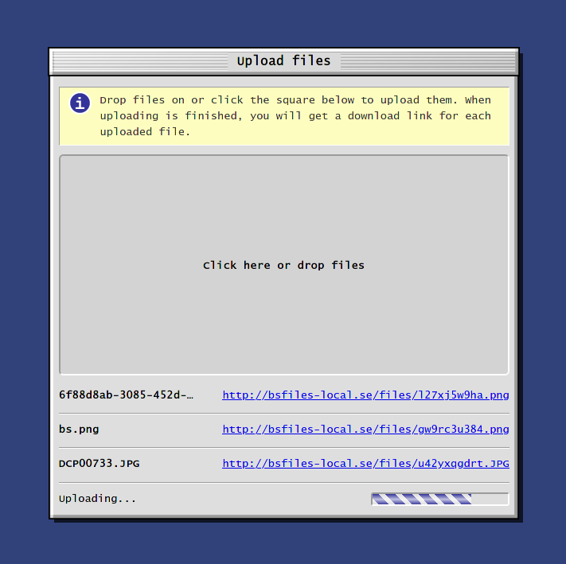

A simple file upload server with authentication. Written in Python and Flask.

To upload files, one must log in. Since it is primarily intended for my personal server,
and I do not have a lot of storage space on my VPS, there is no signup page;
instead, users have to be created manually. This is to prevent random people
from signing up and uploading stuff, taking up disk space.


<p align="center">
  
</p>


# Features

* Upload files
* Cool 90's OS aesthetic
* **File drop:** lets you upload a single file which can then be retrieved from
  from the same page. This allows you to quickly share a file between two devices
  without having to copy over the download link.
* CLI: a script is provided which you can use to upload or drop files or get
  your dropped file (more on this below)
  
 
# CLI

You can upload files directly from the terminal by using the script provided in
[cli/bsfiles.sh](https://github.com/dheurlin/bsfiles/blob/master/cli/bsfiles.sh):

* `bsfiles.sh upload [filename]`: uploads a file and prints the download link
* `bsfiles.sh drop [filename]`: uploads a file and makes it your dropped file
* `bsfiles.sh getdrop`: downloads your dropped file


You need to edit the script and fill out the url to your bsfiles instance, and
optionally your username and/or password. If you leave either or both of the
latter blank, you will be prompted for them.

Then move or symlink the script to a location in your `$PATH` and you're ready
to go!

When you log in via this script, the login cookie is saved in
`$HOME/.cache/bsfiles`, so you won't have to enter your credentials every time.

# How to run

This project is designed to be run in a Docker container. Before you can start
the container, you have to specify a few environment variables:

## Environment variables

The file `secrets.env.template` contains a list of all variables that must be
filled in to start the server. Copy this file to `secrets.env` and fill in the
blanks. One variable of note is `FLASK_ENV`: setting this to "development" will
start Flask in development mode, and setting it to "production" will start it in
production mode.

Once you have filled these in, you can run `docker-compose build` and then
`docker-compose up (-d)` to start the container.

## Aliases

The file `aliases.sh` defines some useful functions that can be executed inside
the Docker container. Run `source aliase.sh` to get access to them. To get rid
of them, run `deactivate` and they will be unregistered.

## Creating a user

This site only works for logged in users, so we need at least one user for it to
be meaningful. Since we do not have a signup form, we create users using a
command: If you have sourced the aliases file as described above, simply run
`create-user [username] [password]` and a user will be created with the desired
username and password.

## NGINX Config

If you are running NGINX, there are a few configuration options that must be
enabled:

### Protected uploads

This protects its uploads directory so that its files cannot be accessed
directly. Instead, they are accesed through `X-Accel-Redirect`, which requires
some configuration in NGINX to work:

```
server {
    ...

    # Protect the uploads directory
    location /uploads/ {
        deny all;
    }

    # make protecteUploads an alias to uploads, though only accessible through X-Accel-Redirect
    location /protectedUploads/ {
       internal;
       alias {path-to-this-repo}/uploads/;
   }

}

```

### Preserve URL

We also need to preserve the original URL when requests are proxied to the
docker container, in order for Flask to know the absolute url for download
links. To do this, add `proxy_set_header Host $host;` under `location /` in the
server block.

### Socket

While the development server exposes a port for proxy-passing to, the production
environment instead uses a Unix socket (via uWSGI). Replace your `location /` with the
following for use in production:

```
location / {  try_files  $uri  @bsfiles ; }

location  @bsfiles {
    include uwsgi_params;
    proxy_set_header Host $host;
    uwsgi_pass unix:<path to this repo>socket/app.sock;
}

```

### Static files

To make NGINX serve static files, include the following:

```
location /static/ {
    alias <path to this repo>/project/bsfiles/static/;
}

```

# Developing

A few things to keep in mind if you want to modify this code:

* If you add or modify models, you have to create a migration. If you have
  sourced the aliases file as described above, run `flask-migrate [migration
  message]` to create a migration. When the Docker container is started,
  migrations are automatically applied. Make sure to commit your migration files
  to git!
* The project uses SASS for its stylesheets. There is a `sass watch` command
  executed at startup, so any changes you make to the styles while the container
  is running should be compiled automatically.
